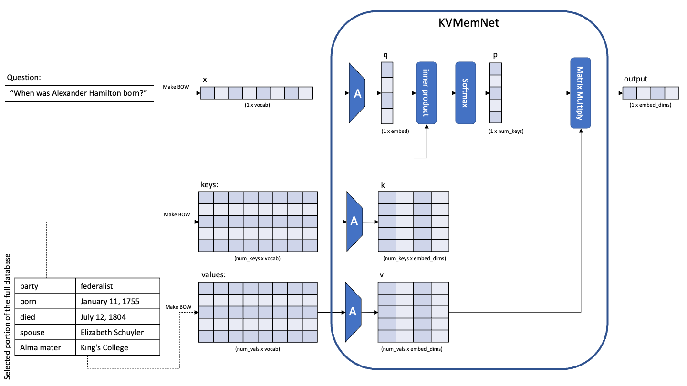
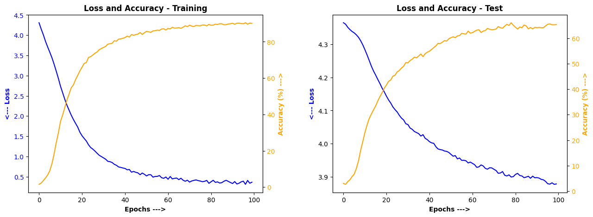

# NLP Model for Answering Questions in Natural Language from a Dataset

## Overview
This project develops a model to answer natural language queries about famous people using data from **Wikipedia Biography** pages. The model enables external content updates without retraining, ensuring up-to-date responses. See the full Juypter [notebook](KeyValueMemNet_Wikipedia_Persons.ipynb) that includes code, output, and detailed analysis.

## Problem Statement
Each biography consists of structured information (e.g., birth date, career details, family). The model interprets natural language variations of queries and retrieves accurate answers. For example:
- *When was Alexander Hamilton born?*
- *What is the birth date of Alexander Hamilton?*
- *When is Alexander Hamilton's birthday?*

## Key-Value Memory Networks (KVMemNets)
The model is based on **Key-Value Memory Networks**, a neural architecture that stores and retrieves facts from an external memory. KVMemNets map queries to **keys** (fact variations) and retrieve corresponding **values** (answers) through attention mechanisms.

### How It Works
1. Queries are embedded and matched against stored *keys* (e.g., "Microsoft Chief Executive Officer").
2. Attention mechanisms score and select the most relevant key.
3. A weighted representation is compared against *values* (e.g., "Satya Nadella").
4. The highest similarity score determines the final answer.

## Why KVMemNets?
KVMemNets allow dynamic data updates without retraining. Though superseded by transformers, they offer an excellent foundation for understanding self-attention mechanisms.

## Results
Initial training showed strong learning ability, with high training accuracy (>90%) but lower testing accuracy (~50%), indicating overfitting. To address this, dropout layers were added introducing noise to improve robustness.
- Training accuracy decreased slightly to 88%.
- Testing accuracy improved significantly to 65%, reducing overfitting.

Loss and accuracy curves for this improved model are shown below.

## References
For further details, refer to the original [paper](https://arxiv.org/abs/1606.03126) on Key-Value Memory Networks.
